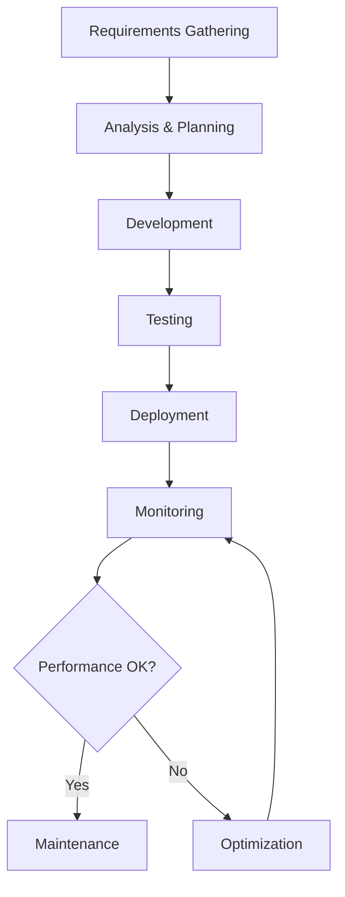

::: {.about-hero}

# About Me

I am a results-driven technical professional with a strong foundation in analytics, software development, and digital product delivery. I combine practical industry experience with a disciplined approach to problem solving, delivering reliable solutions that support business goals and improve operational efficiency.

- Driving cross-functional collaboration to build polished products 
- Translating business needs into scalable technical solutions 
- Using data to inform decisions and improve outcomes 
- Committing to clear communication and quality execution 

:::

::: columns

::: {.column width="65%"}

## Core Expertise

::: {.callout-note}
## Technical Leadership
Translating business needs into scalable technical solutions with a focus on maintainability and performance.
:::

::: {.callout-tip}
## Development Approach
Building maintainable applications using Python and modern web technologies, following best practices for code quality and testing.
:::

## Experience

- **[Data Analyst]**, [Tech Company] — [2022-Present]
  - Delivered technical solutions aligned to product goals and stakeholder requirements.
  - Improved project efficiency through clear documentation, testing, and process refinement.
  - Collaborated with designers, engineers, and business teams to deliver polished outcomes.

## Professional Goals

::: {.custom-goals .bg-light .p-3 .rounded}
I am focused on continuing to grow my technical expertise, contributing to impactful projects, and building a portfolio of work that reflects strong execution, craftsmanship, and professional growth.
:::

### Skills Overview

| Category | Skills | Proficiency |
|----------|--------|-------------|
| Programming | Python, JavaScript | Expert      |
| Data Analysis | SQL, Pandas, NumPy | Advanced     |
| Web Development | HTML, CSS, React | Intermediate    |
| Tools | Git, Docker, AWS | Proficient     |

: My technical skill set and proficiency levels



## Workflow Process

## Key Achievements

::: {.callout-success}
## Project Impact
Successfully delivered a data analytics platform that reduced reporting time by 60% and improved decision-making accuracy across the organization.
:::

## Current Learning Path

- [x] Master advanced Python concepts
- [x] Learn cloud architecture patterns
- [ ] Complete machine learning certification
- [ ] Contribute to open-source projects
- [ ] Build personal portfolio website

## Mathematical Foundation

The efficiency of algorithms can be measured using Big O notation[^1]:

$$O(n) = \sum_{i=1}^{n} i = \frac{n(n+1)}{2}$$

[^1]: Big O notation describes the upper bound of algorithm complexity.

:::

::: {.column width="35%"}

### Key Skills

-  Python
-  Data Analysis
-  Web Development
-  Problem Solving
-  Communication

### Education

- **[BSc Computer Science]**, [University Name] — [2021]

### Interests

- Emerging technologies and practical applications 
- Data-driven decision making 
- Web and application development 

:::

:::

::: {.callout-warning}
## Important Note
This portfolio is continuously updated. For the latest information, please check back regularly or contact me directly.
:::
